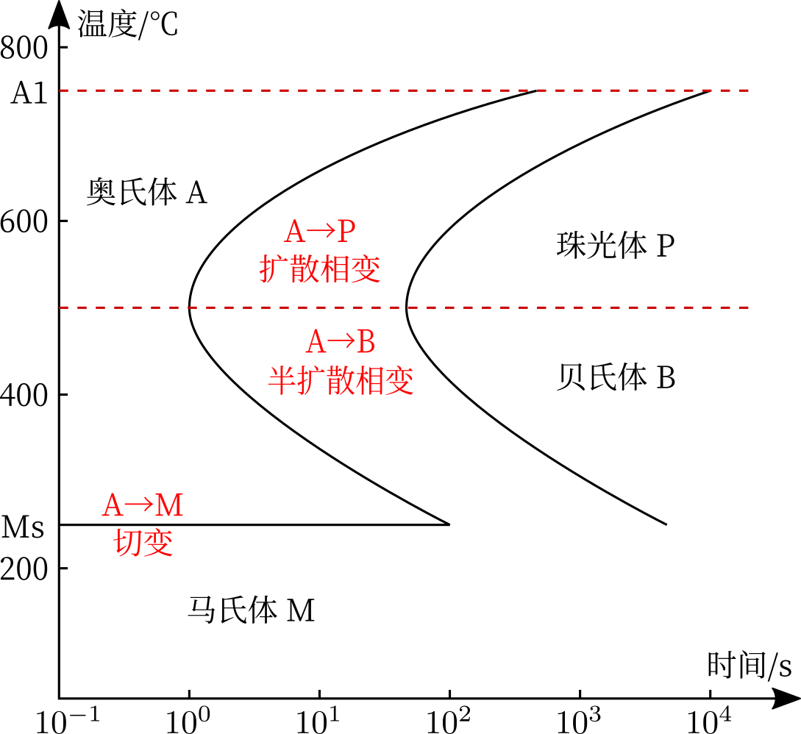

固态相变基础
============

由于钢铁材料最为常用，以下几节，除脱溶沉淀型转变以 Cu-Al 合金为例之外，均考虑铁碳合金。 

分类
----

+--------------+--------------+---------------------------------------------------------------+
| 分类依据     | 类别         | 特点                                                          |
+==============+==============+===============================================================+
| 热力学       | 一级相变     | 化学势不变，熵、体积突变，有潜热                              |
|              +--------------+---------------------------------------------------------------+
|              | 高级相变     | 对于二级，熵、体积不变，比热、压缩系数、膨胀系数突变          |
+--------------+--------------+---------------------------------------------------------------+
| 平衡相图     | 平衡相变     | 同素异构转变&多形性转变、平衡脱溶沉淀、共析、调幅分解、有序化 |
|              +--------------+---------------------------------------------------------------+
|              | 非平衡相变   | 伪共析、马氏体相变、贝氏体相变、非平衡脱溶沉淀                |
+--------------+--------------+---------------------------------------------------------------+
| 原子迁移情况 | 扩散性相变   | 新相与母相成分不同，体积变化、形状不变                        |
|              +--------------+---------------------------------------------------------------+
|              | 非扩散型相变 | 马氏体相变，成分相同，形状变化，新相与母相有一定晶向关系      |
+--------------+--------------+---------------------------------------------------------------+
| 相变方式     | 有核相变     | 大部分                                                        |
|              +--------------+---------------------------------------------------------------+
|              | 无核相变     | 调幅分解，依靠上坡扩散                                        |
+--------------+--------------+---------------------------------------------------------------+

特点
----

1. 相界面存在不同的共格状态
#. 新相与母相有一定位相关系（除非是非共格界面），存在惯习面
#. 相变阻力大
   
   弹性应变能：盘状<球状；共格>非共格

   界面能：盘状>球状；共格<非共格

#. 易产生过渡相
#. 晶体缺陷起催化作用
#. 原子的扩散与过冷度有关

热力学
------

热力学条件是自由能降低，表观上条件是过冷度或过热度。但要使相变进行，还要考虑越过能垒，激活能 :math:`Q` 可由热振动不均匀性、机械应力或电磁场提供。自扩散系数

.. math:: D=D_0\cdot\exp(-\frac{Q}{RT})

形核
----

先在母相中形成核胚，若核胚尺寸超过某一临界值，便能稳定存在并自发长大，成为新相晶核。固态相变的驱动力有体积自由能差、晶体缺陷；阻力有相界面能、弹性应变能。

均匀形核
++++++++

自由能变 

.. math:: \Delta G=-V\cdot G_v+S\sigma+V\varepsilon

:math:`V` 为新相体积； :math:`\Delta G_v` 为两相间的单位体积自由能差； :math:`S` 为新相表面积； :math:`\sigma` 为两间的单位面积界面能； :math:`\varepsilon` 为新相单位体积弹性应变能。相比液相中形核，多了最后一项。设新相为球形，则临界晶核半径

.. math:: r_c=\frac{2\sigma}{\Delta G_v-\varepsilon}

非均匀形核
++++++++++

自由能变 

.. math:: \Delta G=-V\cdot G_v+S\sigma+V\varepsilon-\Delta G_d

最后一项 :math:`\Delta G_d` 表示非均匀形核时晶体缺陷消失或减少而降低的能量，与形核位置有关。令 :math:`\chi=\frac{\sigma_{\alpha\alpha}}{\sigma_{\alpha\beta}}` ，则无需额外能量即可形核的条件是

- 晶界： :math:`\chi\ge2`
- 晶棱： :math:`\chi\ge\sqrt{3}`
- 晶隅： :math:`\chi\ge2\sqrt{\frac 2 3}`   

位错、空位也会促进非均匀形核。晶界附近的空位扩散到晶界中，使得晶界附近出现“无析出带”。 

长大
----

新相晶核的长大，实质上是界面向母相方向的迁移。若新相与母相成分相同，则长大过程不需要扩散。 

界面迁移方式
++++++++++++

- 半共格界面

  - 协同型长大（位移式长大）：如马氏体相变，晶核长大通过半共格界面上母相一侧原子的切变完成，为非扩散型相变。
  - 台阶式长大：界面位错位于同一平面上时，必须通过攀移才能长大；而界面位错阶梯状分布时，滑移运动就可使界面迁移，使新相长大。

- 非共格界面：在界面可能发生原子自由迁移或者由母相台阶向新相台阶迁移。

长大速度
++++++++

非扩散型相变长大速度很快。 

对于扩散型相变，若无成分变化，速度主要取决于短程扩散。假设降温冷却，由母相 :math:`\gamma` 转变为新相 :math:`\alpha` 时，势垒为 :math:`\Delta g` ，原子振动频率为 :math:`\nu_0` ，跳跃距离为 :math:`\lambda` ，则新相长大速度

.. math:: u=\lambda \nu_0\exp(-\frac{\Delta g}{kT})\left[1-\exp(-\frac{\Delta G_{\gamma\to\alpha}}{kT})\right]

因而

- 温度较高时， :math:`T\downarrow\Rightarrow u\uparrow` 
- 温度较低时， :math:`T\downarrow\Rightarrow u\downarrow` 

若有成分变化，则新/母相内部存在浓度梯度，引起长程扩散，而相界面上浓度比为定值，因而产生相间扩散。假设降温冷却，由母相 :math:`\gamma` 转变为新相 :math:`\alpha` 时，溶质原子在 :math:`\gamma` 相中扩散系数为 :math:`D` ，则长大速度

.. math:: u=\frac{\mathrm{d}x}{\mathrm{d}t}=\frac{D}{|C_\gamma-C_\alpha|}\left(\frac{\partial C_\gamma}{\partial x}\right)_{x_0}

因而 :math:`T\downarrow\Rightarrow D\downarrow\Rightarrow u\downarrow` ，此外等温条件下，随时间延长 :math:`\left(\frac{\partial C_\gamma}{\partial x}\right)_{x_0}\downarrow\Rightarrow u\downarrow` 

动力学
------

设新相形核速率恒为 :math:`\dot{N}` ，形核后以恒定速度 :math:`v` 长成各向同性的球状，晶体体积为 :math:`V` ，则时间 :math:`t` 时，某个孕育时间为 :math:`\tau` 的晶粒体积为 :math:`\frac{4}{3}\pi v(t-\tau)^3` 。而母相中 :math:`\mathrm{d}\tau` 时间内形核数为 :math:`\dot{N}(V-V^\beta)\mathrm{d}\tau` ，则 :math:`\mathrm{d}V^\beta=\frac{4}{3}\pi v(t-\tau)^3\dot{N}(V-V^\beta)\mathrm{d}\tau` 。于是得到 Johnson-Mehl 方程，相变体积分数：

.. math:: f=1-\exp\left(-\frac{\pi}{3}\dot{N}v^3t^4\right)

更为一般的形式是 Avrami 方程： 

.. math:: f=1-\exp(-Kt^n)

函数呈 S 形，速度存在峰值。 

TTT曲线
+++++++

等温转变图，表征平衡相变。 

测试方法： 

- 金相硬度法
- 膨胀法
- 磁性法
  
基本类型： 

- 单一 C 形。两条 C 曲线合并而成，鼻尖划分相变。碳钢以及含有 Si、Ni、Cu、Co 等合金元素的钢均属于此种。
- 双 C 形。加入合金元素（如Cr、Mo、W，V等）使珠光体、贝氏体转变温度范围分离
- 仅有贝氏体转变。含Mn、Cr、Ni、W、Mo量高的低碳钢中，扩散型的珠光体转变受到极大阻碍。
- 只有珠光体转变。中碳高铬钢属于此种。
- 仅有马氏体转变。这类钢通常为奥氏体钢，高温下稳定的奥氏体组织能全部过冷至室温。
  
影响因素： 奥氏体越均匀稳定，转变越困难 

- 合金元素：最重要。Co、Al左移，其他右移。对于 C，亚共析钢 C↑，右移；过共析钢 C↓，左移。
- 晶粒尺寸：奥氏体细小时，促进珠光体转变，而贝氏体不受影响。
- 制取奥氏体时：原始组织越细、加热温度越高、保温时间越长，越右移。
- 塑性变形：促进珠光体转变

CCT曲线
+++++++

连续冷却转变图，表征非平衡相变。 

测试方法：综合使用膨胀法、端淬法、金相硬度法、热分析法和磁性法。 

相比 TTT： 

- 有若干从左上至右下的冷却曲线。与各相转变终止线交点标注的数字代表冷却至室温后组织的体积百分数；下端的数字代表冷却所获组织的维氏硬度。
- 孕育期长，处于TTT曲线的右下方。
- 也可以缺失珠光体转变/贝氏体转变。
- 合金元素的影响类似。
- 提高冷却速度，可以抑制各种相变，因而有各种对应的临界冷却速度。使奥氏体完全转变为马氏体（和残余奥氏体），需要临界淬火速度。临界淬火速度越低，越容易得到完全的马氏体组织。
  