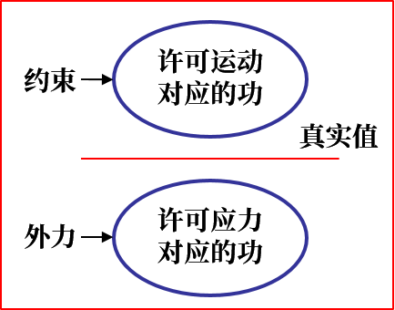

塑性力学
========

以下各量均视为张量

以 :math:`\pmb{r}` 表示坐标， :math:`\pmb{u}` 表示位移， :math:`\pmb{\sigma}` 表示应力， :math:`\pmb{\varepsilon}` 表示应变。用爱因斯坦表示法：

基本参量
--------

应力
++++

- 法向量为单位向量 :math:`\pmb{r}` 的面上的应力： :math:`S_i=\sigma_{ij} r_j` ，主应力 :math:`\sigma=S_i r_i`
- 主应力 :math:`(\sigma_1,\sigma_2,\sigma_3)` 是 :math:`\pmb{\sigma}` 的特征值，其方向就是特征向量
- 三个应力张量不变量：
  
  .. math::

     \left\{
     \begin{split}
     J_1&=\sigma_x+\sigma_y+\sigma_z\\
     J_2&=-(\sigma_x\sigma_y+\sigma_y\sigma_z+\sigma_z\sigma_x)+\tau_{xy}^2+\tau_{yz}^2+\tau_{zx}^2\\
     J_3&=\sigma_x\sigma_y\sigma_z+2\tau_{xy}\tau_{yz}\tau_{zx}-(\sigma_x\tau_{yz}^2+\sigma_y\tau_{xz}^2+\sigma_z\tau_{xy}^2)
     \end{split}
     \right.

  则主应力可表示成 :math:`\sigma^3+J_1\sigma^2+J_2\sigma+J_3=0` 的解。

- 三个主切应力 :math:`\tau_{ij}=\frac{1}{2}(\sigma_i-\sigma_j)~(i,j=1,2,3)` 
- 平均应力（静水压力的相反数）： :math:`\sigma_m=\frac{1}{3}\sigma_{ii}` ，应力偏张量 :math:`\sigma_{ij}'=\sigma_{ij}-\delta_{ij}\sigma_m` 
- 等效应力：
  
  .. math::

     \begin{split}
     \bar{\sigma}&=\sqrt{\frac{1}{2}[(\sigma_1-\sigma_2)^2+(\sigma_2-\sigma_3)^2+(\sigma_3-\sigma_1)^2]}\\
     &=\sqrt{\frac{1}{2}[(\sigma_x-\sigma_y)^2+(\sigma_y-\sigma_z)^2+(\sigma_z-\sigma_x)^2+6(\tau_{xy}^2+\tau_{yz}^2+\tau_{zx}^2)]}\\
     &=\sqrt{\frac{3}{2}\sigma_{ij}'\sigma_{ij}'}
     \end{split}

- 真应力： :math:`S=\sigma(1+\varepsilon)` 

应变
++++

- 某方向的应变、主应变、应变偏张量、平均应变类似于应力，等效应变 

  .. math:: 
     
     \begin{split}
     \bar{\varepsilon}&=\frac{\sqrt{2}}{3}\sqrt{(\varepsilon_1-\varepsilon_2)^2+(\varepsilon_2-\varepsilon_3)^2+(\varepsilon_3-\varepsilon_1)^2}\\
     &=\sqrt{\frac{2}{3}\varepsilon_{ij}'\varepsilon_{ij}'}
     \end{split}

- 应变连续方程：
  
  .. math::

     \left\{
     \begin{split}
     \frac{\partial^2\gamma_{xy}}{\partial x\partial y}=\frac{1}{2}\left(\frac{\partial^2\varepsilon_x}{\partial y^2}+\frac{\partial^2\varepsilon_y}{\partial x^2}\right)\\
     \frac{\partial^2\gamma_{yz}}{\partial y\partial z}=\frac{1}{2}\left(\frac{\partial^2\varepsilon_y}{\partial z^2}+\frac{\partial^2\varepsilon_z}{\partial y^2}\right)\\
     \frac{\partial^2\gamma_{xz}}{\partial x\partial z}=\frac{1}{2}\left(\frac{\partial^2\varepsilon_x}{\partial z^2}+\frac{\partial^2\varepsilon_z}{\partial x^2}\right)
     \end{split}
     \right.

  意味着每个平面上三个应变分两种仅有两个可独立变化。

- 真应变 :math:`\epsilon=\ln(1+\varepsilon)` 

其他
++++

- 切变弹性模量 :math:`G=\frac{E}{2(1+\mu)}` ，体积弹性模量 :math:`B=\frac{E}{3(1-2\mu)}` 
- 变形能 :math:`w=\frac{1}{2}\sigma_{ij}\varepsilon_{ij}` 

基本方程
--------

- 应力平衡微分方程：
  
  .. math:: \frac{\partial}{\partial r_j}\sigma_{ij}=0

- 应变几何方程：
  
  .. math:: \varepsilon_{ij}=\frac{1}{2}\left(\frac{\partial u_i}{\partial r_j}+\frac{\partial u_j}{\partial r_i}\right)

  对于轴对称问题比较复杂：

  .. math::

     \left\{
     \begin{split}
     &\varepsilon_\rho=\frac{\partial u_\rho}{\partial \rho},~\varepsilon_\theta=\frac{u_\rho}{\rho},~\varepsilon_z=\frac{\partial u_z}{\partial z}\\
     &\gamma_{\rho z}=\frac{1}{2}\left(\frac{\partial u_z}{\partial \rho}+\frac{\partial u_\rho}{\partial z}\right)\\
     &\gamma_{\rho\theta}=\gamma_{\theta z}=0
     \end{split}
     \right.

- 本构方程：弹性本构方程
  
  .. math:: \varepsilon_{ij}=\frac{1+\mu}{E}\sigma_{ij}'+\frac{1-2\mu}{E}\delta_{ij}\sigma_m

  说明物体的体积变形仅与球应力成正比；形状变化仅与偏应力成正比。
  
  塑性变形与路径有关，因而增量式更有意义。根据列维-米塞斯理论，对于理想刚塑性材料：

  .. math:: \mathrm{d}\varepsilon_{ij}=\frac{3\mathrm{d}\bar{\varepsilon}}{2\bar{\sigma}}\sigma_{ij}'

  可见静水压力越大，材料塑性越好。

- 屈服条件：以 :math:`\sigma_s` 为屈服强度， :math:`K` 为剪切屈服强度
  
  - 米塞斯： :math:`\bar{\sigma}=\sigma_s=\sqrt{3}K` 
    
    对于平面应力状态 :math:`\sigma_x^2+\sigma_y^2-\sigma_x\sigma_y+3\tau_{xy}^2=\sigma_s^2`，对于平面应变状态 :math:`(\sigma_x-\sigma_y)^2+4\tau_{xy}^2=\frac{4}{3}\sigma_s^2`，对于轴对称应力状态 :math:`(\sigma_r-\sigma_\theta)^2+(\sigma_\theta-\sigma_z)^2+(\sigma_z-\sigma_r)^2+6\tau_{rz}^2=2\sigma_s^2` 

  - 屈雷斯加： :math:`|\sigma_1-\sigma_3|=\sigma_s=2K`

    对于任意坐标系下的平面应变状态 :math:`(\sigma_x-\sigma_y)^2+4\tau_{xy}^2=\sigma_s^2`
    
- 刚塑性材料的体积不变条件： :math:`\varepsilon_{ii}=0`
  
主应力法
--------

只有平面应力问题是静定的，其他一般静不定。主应力法以均匀塑性变形为前提，将偏微分应力平衡方程化为常微分，将米塞斯屈服准则二次方程化为线性方程，最后求解一阶常微分方程。可以求解变形力和变形功，但无法求出变形体内应力分布。

近似处理
++++++++

- 塑性条件：平面应变问题简化为 :math:`\sigma_x-\sigma_y=2k\to\mathrm{d}\sigma_x=\mathrm{d}\sigma_y` 其中 :math:`k=\frac{\sigma_s}{\sqrt{3}}` ；轴对称问题简化为 :math:`\sigma_r-\sigma_z=\sigma_s\to\mathrm{d}\sigma_r=\mathrm{d}\sigma_z` 
- 摩擦力：滑动摩擦 :math:`\tau_k=\mu\sigma_n` ；常摩擦 :math:`\tau_k=k`

求解步骤
++++++++

1. 切取单元体
#. 列出静力平衡方程，整理成常微分方程
#. 代入摩擦条件
#. 引用屈服准则
#. 求微分方程通解
#. 根据边界条件确定解

上限法
------

仅考虑约束条件，可以得到无数虚功，他们都大于外力真实做功，则这些虚功的最小值就是真实值的 **上限** 。类似的，仅考虑外力条件可以得到 **下限** 。但是上限具有容余量，更具实际意义。

真实表面力做功应小于塑性变形功、速度不连续面消耗功、克服表面磨擦消耗功之和，即 

.. math:: \int_{S_u}T_i v_i\mathrm{d}S\le\int_V\sigma-{ij}^*\dot{\varepsilon}_{ij}^*\mathrm{d}V+\sum\int_{S_D}K[V_t]\mathrm{d}S_D-\int_{S_T}T_i v_i^*\mathrm{d}S

Johnson上限模式
+++++++++++++++

自由面的上限输入功率等于速度不连续面摩擦消耗功之和，即 

.. math:: P^*v_i=\sum\int_{S_D}K[V_t]\mathrm{d}S_D

而功率消耗系数 :math:`n_\sigma=\frac{p}{2K}` 

**求解步骤** ：

1. 建立刚性三角形块速度场
#. 根据速度不连续量平行于速度不连续面，绘制速端图
#. 计算剪切功率消耗
#. 求出最小值，即为上限解
#. 计算功率消耗系数
