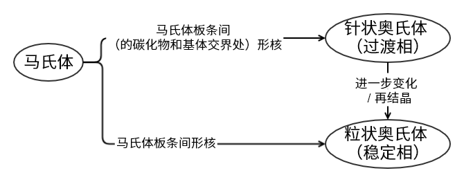

奥氏体相变
==========

即逆共析相变 

奥氏体
------

奥氏体是碳原子固溶在 γ-Fe 的八面体间隙中形成的。碳原子半径较大，引起晶格畸变。通常是多边状等轴晶，会出现相变孪晶。

通过加入合金元素，可以使奥氏体钢在室温下稳定。其性能特点有： 

- 滑移系多，硬度、强度低，塑性好，易变形
- 比体积最小
- 高温强度高
- 顺磁性
- 线膨胀系数大
- 导热性差，加热时速度宜低
  
奥氏体一般通过珠光体加热发生逆共析相变获得，平衡转变温度为 :math:`A_1` 实际加热冷却的临界点分别附上“c”和“r”表示，如 :math:`Ac_1` 。

形成机制
--------

共析钢奥氏体
++++++++++++

1. 形核：奥氏体晶核依靠能量起伏、浓度起伏和结构起伏形成。一般在铁素体和渗碳体的相界面上形核，也可以在珠光体团边界、铁素体亚晶界。
2. 长大：各种长大过程都是两种扩散的共同结果：一相种不同界面溶质浓度不同引起相内扩散；相内扩散改变相界面上溶质浓度，而相界面两侧溶质浓度比一定，因而产生相间扩散。对于在珠光体中形核的奥氏体， :math:`C_{\gamma/\mathit{cem}}>C_{\gamma/\alpha}` 引起相内扩散；因而 C 从渗碳体扩散入奥氏体，Fe 从铁素体扩散入奥氏体；奥氏体长大。
3. 剩余碳化物溶解：由于碳浓度差不同，总是铁素体先消失。渗碳体溶解一般通过碳原子扩散进行。
4. 奥氏体均匀化：只有继续加热或保温，借助于碳原子的扩散，才能使整个奥氏体中碳的分布趋于均匀。

非共析组织奥氏体
++++++++++++++++

也是珠光体中先形核并转变为奥氏体，之后奥氏体向剩余的先共析相扩展，最后全部变为细小奥氏体晶粒。 

非平衡组织奥氏体
++++++++++++++++

低、中碳合金马氏体向奥氏体转变的规律： 

非平衡组织加热转变不仅与加热前的组织状态有关，还与加热过程有关。 

等温形成动力学
--------------

奥氏体形成速度取决于形核率 :math:`I` 和长大速度 :math:`G` ，等温条件下 :math:`I` 和 :math:`G` 为常数。随温度升高， :math:`I` 和 :math:`G` 迅速增大。

.. math:: I=C\exp(-\frac{Q+W}{kT}),G=-K\bar{D}_c^\gamma\frac{\mathrm{d}C}{\mathrm{d}x}\cdot\frac{1}{\Delta C_B}

其中 :math:`C,K` 为常数， :math:`Q` 为扩散激活能， :math:`\bar{D}_c^\gamma` 为碳在奥氏体中扩散系数， :math:`\frac{\mathrm{d}C}{\mathrm{d}x}` 为相界面处奥氏体中碳的浓度梯度， :math:`\Delta C_B` 为新旧相界面两侧碳浓度差，形核功 :math:`W` 取决于界面能 :math:`\sigma` 和新旧相单位体积自由能差 :math:`\Delta G_v` ： 

.. math:: W=C'\frac{\sigma^3}{\Delta G_v^2}

可以将等温转变过程表示为TTA曲线，包括了奥氏体开始形成、转变完成、剩余碳化物溶解、均匀化的过程。 其特点有： 

- 温度升高，孕育时间和转变时间都大幅缩短
- 最后两阶段耗时最长

形成速度的影响因素
++++++++++++++++++

- 加热温度越高，奥氏体形成越快，晶粒越细，剩余碳化物越多，成分越不均匀。有利于提高淬火钢韧性。
- 碳含量越高，奥氏体形成越快。但在过共析钢中会导致最后两阶段变慢。
- 原始组织越细，奥氏体形成越快（片状珠光体相界面大于粒状）。
- 合金元素不影响转变序列：
  
  - 强碳化物形成元素（Mo、W、Cr）：降低碳的扩散系数，减慢奥氏体形成。
  - 非碳化物形成元素（Co、Ni）：增大碳的扩散系数，加速奥氏体形成。
  
  钢中的合金元素可能改变相变临界点位置，还会影响珠光体层片间距以及碳在奥氏体中的溶解度。此外，奥氏体均匀化过程也包含了合金元素的均匀化。

连续形成动力学
--------------

相比等温转变，随加热速度增大： 

- 相变临界点升高
- 各阶段向高温区移动
- 奥氏体形成速度增大
- 成分不均匀性增大，可能产生有害的低、中碳马氏体
- 起始晶粒细化，此时也会在铁素体亚晶界上形核

晶粒长大
--------

奥氏体晶粒度分为8级，级别 :math:`N=1+\log_2 n` ，其中 :math:`n` 为 :math:`6.45\mathrm{mm}^2` 中的晶粒数，决定式 :math:`n=K\sqrt{\frac{I}{G}}` ，8级以上为超细晶粒。晶粒度有三种： 

- 起始晶粒度：奥氏体晶粒边界刚互相接触时，取决于 :math:`\frac{I}{G}` 
- 本质晶粒度：在标准实验方法， :math:`930\pm10\ ^\circ\!C` 保温足够时间。1~4级为本质粗晶粒钢，5~8级为本质细晶粒钢。
- 实际晶粒度：实际结果，取决于本质晶粒度和实际加热条件

长大机理
++++++++

奥氏体晶粒长大通过晶界推移实现，起始晶粒度越小，长大倾向越大。 

动力：界面能。为了保持界面张力平衡，相交于一点的三条晶界应互成 :math:`120^\circ` 角，则边数不为6的晶粒晶界出现曲率。为了降低界面能，晶界趋于平直，产生驱动力 :math:`F=\frac{2\sigma}{R}` ，其中 :math:`\sigma` 为界面能， :math:`R` 为界面曲率半径。最终大晶粒吞并小晶粒，产生聚集再结晶。在界面处溶入降低界面能的合金元素（如稀土），可以细化晶粒。

阻力：第二相粒子钉扎晶界。粒子越小，钉扎越强。晶粒平均极限半径 :math:`R_{Lim}=\frac{4r}{3f}` 决定于第二相粒子半径 :math:`r` 及其数目密度 :math:`f` 。在 :math:`950\ ^\circ\!C` 以上，第二相粒子溶解或聚合长大，因而奥氏体迅速长大。由于第二相粒子分布不均匀，可能出现晶粒大小极不均匀的情况，即“混晶”。细化奥氏体晶粒需要足够数量、足够细小的第二相粒子。

影响因素
++++++++

- 加热温度和保温时间：越高、越长，晶体越粗。在一定温度下，晶粒大小将趋于定值。
- 加热速度：越高，起始晶粒越细。但不宜长时间保温。
- 碳含量：碳含量较少时，碳含量增加，晶粒变粗；碳含量多至出现剩余碳化物时，反而抑制长大。也就是说，同温度下共析钢晶粒长大倾向最大。
- 合金元素：形成化合物越难溶，阻碍越强。由弱到强为：Cu, Ni, Si, Cr, Mo, W, V, Zr, Ti, Al。
- 冶炼方法：Al 脱氧钢中存在弥散 AlN，本质细；Si、Mn脱氧钢本质粗。
- 原始组织：越细，碳化物弥散，起始晶粒越细。