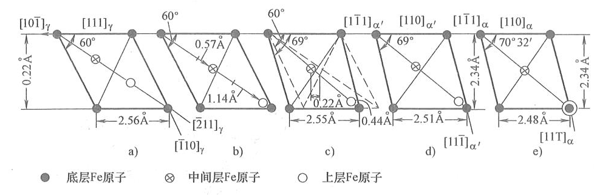

马氏体相变
==========

即切变共格相变，新相与母相保持共格关系。 

基本特点
--------

不同于扩散型相变的特征： 

- 切变共格，表面形成浮突
- 无扩散，可以在低温下极快速进行
- 位向关系：
  
  - K-S 关系： :math:`\{111\}_\gamma\parallel\{110\}_{\alpha'};\langle110\rangle_\gamma\parallel\langle111\rangle_{\alpha'}` 有24种取向
  - 西山关系： :math:`\{111\}_\gamma\parallel\{110\}_{\alpha'};\langle112\rangle_\gamma\parallel\langle110\rangle_{\alpha'}` 有12种取向
  - G-T关系：基于K-S关系，略有偏差

- 惯习面：以母相晶面指数表示，随碳含量增加，依次为 :math:`\{111\}_\gamma,\{225\}_\gamma,\{259\}_\gamma`
- 非恒温性：马氏体相变开始点为 :math:`M_s` ，不需要孕育期。但是为使相变能继续，必须不断降温，马氏体相变终了点为 :math:`M_f` ，此时仍会留下残余奥氏体。若 :math:`M_s` 低于室温，则可得到室温奥氏体组织。

热力学
------

:math:`T_0` 为 :math:`\alpha'` 相与 :math:`\gamma` 相能量相等的温度， :math:`M_s` 为奥氏体和马氏体两相自由能差达到相变所需最小驱动力值时的温度。同样，对于逆相变，有 :math:`A_s,A_f` 。塑性变形的机械驱动力可代替化学驱动力，促进马氏体转变/逆转变， :math:`M_d,A_d` 更加接近 :math:`T_0` 。

:math:`M_s` 的影响因素：

- 碳含量：增加，相变温度范围下降。
- 合金元素：合金元素对 :math:`M_s` 点的影响主要决定于它们对平衡温度T的影响以及对奥氏体的强化作用。Al 和 Co 使 :math:`M_s` 升高，其他元素均使其降低。
- 形变与应力：多向压应力阻止马氏体相变，降低 :math:`M_s` 
- 奥氏体化条件：不完全奥氏体化时，提高温度、延长保温时间降低 :math:`M_s` ；完全奥氏体化时则提高 :math:`M_s` 。晶粒细化降低 :math:`M_s` 。
- 冷却速度： :math:`M_s` 随淬火速度 S 形上升，这是由于快速淬火抑制了碳原子气团的形成
- 磁场：可用磁能代替一部分化学驱动力，提高 :math:`M_s` ，对转变量基本无影响。

晶体学模型
----------

目前没有符合实际的假说。 

K-S切变模型和西山模型
+++++++++++++++++++++

:math:`\bullet,\otimes,\circ` 分别表示ABC三层原子，切变过程分三步：

1. 第一切变：在 :math:`\{111\}_\gamma` 面上，沿 :math:`[\bar{2}11]_\gamma` 移动
2. 第二切变：在 :math:`\{21\bar{1}\}` 面上，沿 :math:`[1\bar{1}1]_{\alpha'}` 移动
3. 必要的线性调整，变为马氏体晶格
   
然而惯习面与实际不符，在此基础上调整的西山模型也与实际不符。 

G-T模型
+++++++

依照G-T关系，当沿惯习面的均匀切变不能满足晶体结构要求时，可沿着“马氏体”晶面发生第二次非均匀切变（原子呈薄层状错位，不改变晶格类型和参数）合成。之后再进行晶格常数调整。仍与实际不符。

动力学
------

- 降温瞬时形核、形核长大：在一定温度下马氏体晶体长到一定尺寸，相变速度由冷却速度决定，马氏体转变量由过冷度决定
- 等温形核、瞬时长大：晶核等温形成（有孕育期），形核率随过冷度增加而先增后减，马氏体转变TTT曲线呈 C 形，转变量与过冷度、时间相关。冷却速度足够大时，可以抑制马氏体相变。
- 自触发形核、瞬时长大： :math:`Ms<0\ ^\circ\!\mathrm{C}` 时，第一片惯习面为 :math:`\{259\}_\gamma` 的透镜片状马氏体形成时，尖端应力激发链式反应，产生爆发式转变，伴有响声和放热。晶界是主要阻碍因素。
- 表面马氏体转变：温度稍高于 :math:`M_s` 时，表面不受三向压应力而产生马氏体，有孕育期、长大极慢，惯习面不是 :math:`\{225\}_\gamma` 而是 :math:`\{112\}_\gamma` ，形态为条状

结构与形态
----------

马氏体是 C 在 α-Fe 中的过饱和固溶体，C 存在于体心立方的八面体间隙（棱心和面心），使晶格畸变为为体心正方点阵，这种非对称畸变称为畸变偶极。随碳含量升高，畸变增大，点阵常数 :math:`c` 线性增大， :math:`a` 线性减小， :math:`\frac{c}{a}` 从 :math:`1` 开始线性增大，可依此计算碳含量。

随形成温度降低，主要亚结构由位错变为孪晶，组织形态变化顺序为：板条、蝶状、片状、薄片状。 

板条状马氏体
++++++++++++

- 见于：低碳钢、中碳钢、马氏体时效钢和不锈钢
- 主要亚结构：板条中有高密度位错
- 组织结构：
  
  .. image:: 板条马氏体.png
    :width: 400

  板条间还会有残余奥氏体薄膜

- 与母相位向关系：K-S 与西山之间，G-T 居多
- 碳含量升高：同位相束、板条群趋于消失
- 改变奥氏体化温度：改变奥氏体晶粒大小，板条群大小随之改变，不影响板条宽度

片状马氏体
++++++++++

- 见于：淬火高、中碳钢及高镍的铁合金
- 主要亚结构：孪晶
- 组织结构：透镜片状马氏体片不相互平行，第一个马氏体片贯穿奥氏体晶粒，其间是块状残余奥氏体。马氏体片有中脊，惯习面为 :math:`\{225\}_\gamma` 或 :math:`\{259\}_\gamma` ，两侧为相变孪晶，再外围为有位错的无孪晶区
- 与母相位向关系：K-S 或西山
- :math:`M_s` 降低：孪晶区比例增加（如铁镍合金中镍增加时）

其他形态的马氏体
++++++++++++++++

- 蝶状马氏体：铁镍（钴）合金中，板条与片状形成温度之间形成。有高密度位错，无孪晶，符合 K-S 关系 
- 薄片状马氏体：在 :math:`M_s` 极低的铁镍合金中形成。有孪晶而无中脊。
- ε 马氏体：在奥氏体层错能较低的 Fe-Mn-C 或 Fe-Cr-Ni 合金中有可能形成具有密排六方点阵结构的ε马氏体，为极薄的片状。有高密度位错。

奥氏体稳定化
------------

在外界因素下，奥氏体内部结构发生变化使马氏体转变迟滞。 

热稳定化
++++++++

在淬火中 :math:`M_c` 点以下缓慢冷却或停留，使温度~马氏体转变率曲线下降。热稳定化程度可用滞后温度间隔 :math:`\theta` 或残余奥氏体增量 :math:`\delta` 衡量。

原理是C、N原子偏聚，钉扎晶界，阻止了马氏体化过程，因而稳定化是可逆的（加热到较高温度可反稳定化）。 影响因素： 

- 温度：随温度变化 :math:`\delta` 有最大值
- 时间：随材料不同，可能是单调递增或有最大值
- 合金元素：C、N、Cr、Mo、V 促进稳定化

机械稳定化
++++++++++

少量塑性应变产生内应力集中，利于形核；而塑性变形较大时产生的晶体缺陷破坏共格关系，阻碍马氏体形成。同时已转变的马氏体也会对周围产生机械作用。转变量越大，机械稳定化程度也越大。

力学性能
--------

- 硬度和强度：马氏体最重要的特性：高强度高硬度。硬度随碳含量增加，但碳含量进一步增加时残余奥氏体增加，又降低硬度。
  
  - 相变强化：来自于切变造成的缺陷
  - 固溶强化：非对称畸变偶极带来强烈的强化作用
  - 时效强化：过饱和碳偏聚、析出，钉扎位错从而产生时效强化。对于 :math:`M_s` 低于室温的钢，淬火时伴随着自回火
  - 形变强化：马氏体本身较软，但形变强化指数很大，加工硬化率很高
  - 孪晶强化：减少滑移系
  - 原始奥氏体晶粒：细化对强度提高不大

- 韧性：主要取决于亚结构，位错型马氏体断裂韧性和冲击功远好于孪晶型。为了提高韧性，应保持较低的碳含量。
- 相变诱发塑性：由于在相变过程中，马氏体的形成使应力集中松弛，且发生形变强化，所以塑性、断裂韧性提高。